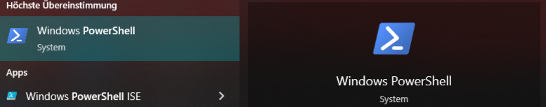

In diesem Guide werdet ihr lernen, wie ihr SSH auf euer Maschiene einrichtet, so dass ihr euch auf die **Rechnerhalle** verbinden könnt. 

# Übersicht

- [Übersicht](#übersicht)
- [RBG-Account / ITO-Account](#rbg-account--ito-account)
- [SSH installieren](#ssh-installieren)
- [SSH](#ssh)
- [SSH ohne Passwort](#ssh-ohne-passwort)

# RBG-Account / ITO-Account

Damit du die Rechnerhalle verwenden kannst, brauchst du einen **RBG- / ITO-Account**. Zu beginn des ersten Semesters habt solltest du eine Email bekommen, in dem ein Link ist, mit dem du einen **RBG- / ITO-Account** erstellen kann.
Bei Fragen und Unklarheiten kann man im offizielles [ITO-Wiki](https://www.cit.tum.de/ito/fuer-studierende/fuer-neue/) nachschalgen.


# SSH installieren

In diesem Abschnitt wird erklärt, wie man `ssh` installiert.

## Windows (WSL)

Aus Erfahrung würde ich allen Windows-Nutzern empfehlen `ssh` über WSL (Windows Subsystem for Linux) zu nutzen. Man kann `ssh` auch über Windows nativ benutzen, die Einrichtung ist meiner Meinung nacher aber komplizierter und in der Vergangheit hab ich immer wieder Probleme bei Windows gesehen.


### WSL installieren
[Offizielle Microsoft Dokumentation](https://learn.microsoft.com/en-us/windows/wsl/install).

Zuerst muss WSL für Windows aktiviert werden. Dafür musst du die **Windows Powershell** oder **Windows-CMD** öffnen und folgenden Befehl ausführen.



```sh
# In Windows Powershell
> wsl --install -d ubuntu
```

Sobald sich eine neue Shell mit Linux öffnet, kannst du weiter dem [**Linux**](#linux) Guide folgen um `ssh` zu installieren.

## macOS

Auf den neueren **macOS**-Versionen sollte `ssh` schon installiert sein. Um zu prüfen ob `ssh` richtig funktioniert, musst du den **Terminal** öffnen und den folgenden Command ausführen.

```sh
> ssh
```

Wenn `ssh` installiert ist, solltest du eine [**usage**-Message](#prüfen-ob-ssh-installiet-ist) bekommen wie sie weiter unten zu sehen ist.

## Linux

`ssh` ist auf den meißten Linux-Distros (auf WSL auch) schon standartmäßig installiert. Sollte das nicht so sein kannst du den folgenden Schritten folgen um `openssh-client` für dein Distro zu installieren.

### Ubuntu (and WSL)

```sh
> sudo apt update  # updates the mirrors 
> sudo apt openssh-client  # install the ssh-client
```

### Arch-based (Manjaro, Endeavour, ...)

```sh
> sudo pacman -Syu  # updates the mirrors 
> sudo pacman -S openssh-client  # install the ssh-client
```

### Prüfen ob SSH installiet ist

```sh
> ssh
```
Falls `ssh` korrekt installiert wurde solltest du eine **usage**-Message bekommen.

```sh
usage: ssh [-46AaCfGgKkMNnqsTtVvXxYy] [-B bind_interface] [-b bind_address]
           [-c cipher_spec] [-D [bind_address:]port] [-E log_file]
           [-e escape_char] [-F configfile] [-I pkcs11] [-i identity_file]
           [-J destination] [-L address] [-l login_name] [-m mac_spec]
           [-O ctl_cmd] [-o option] [-P tag] [-p port] [-R address]
           [-S ctl_path] [-W host:port] [-w local_tun[:remote_tun]]
           destination [command [argument ...]]
       ssh [-Q query_option]

```

# SSH

Ist jetzt `ssh` erfolgreich installiert kannst du mit dem folgenden Befehl auf die **Rechnerhalle** verbinden.

Allerdins musst du hierbei immer noch euer **Passwort** eingeben.

### Auf die Rechnerhalle verbinden
```sh
> ssh <ito-username>@lxhalle.in.tum.de
# Example:
> ssh muster@lxhalle.in.tum.de
```
### Rechnerhalle verlassen
1. Terminal / Fenster Schlißen
2. `exit`-Befehl ausführen
```
> exit
```


# SSH ohne Passwort

### Warum sollte man einen SSH-Schlüssel verwenden?

Wie du warscheinlich schon bemerkt hast, muss du jedes mal dein **Passwort** eingeben, wenn du versuchst dich, per `ssh`auf die Rechnerhalle zu verbinden.
Das kann irgendwann nervig werden, vorallem wenn man mehrere Verbindungen zu dem Server gleichzeitig hat.

Hierfür gibt ein eine praktische Lösung. Man kann sich ein **SSH-Key-Paar** erstellen, wovon man den **Öffentlichen Schlüssel** an die Rechnerhalle schickt. 

Verbindest du dich nun auf die Rechnerhalle  wird jedes mal dein **lokaler, geheimer Schlüssel** mit dem **öffentlichen Schlüssel auf der Rechnerhalle** abgeglichen. 

Wenn alles stimmt kannst du dich sofort verbinden, **ohne dein Passwort eingeben zu müssen**.

Falls du mehr dazu lesen willst is [hier](https://www.ssh.com/academy/ssh/public-key-authentication) ein iformativer Link.


### Ein SSH-Schlüssel-Paar erstellen
> **Hinweise**: Alle folgenden Befehle müssen auf eurem **eigenen Computer** ausgeführt werden, **NICHT auf der Rechnerhalle**. Ihr könnt die rechneralle mit `exit` verlassen

**1. SSH-Schlüssel-Paar erstellen**

```sh
> ssh-keygen -t ed25519
```
**2. Dateinamen unverändern lassen (`<Enter>` drücken)**
```sh
Generating public/private ed25519 key pair.
Enter file in which to save the key (path/to/home/.ssh/id_ed25519):  # <Enter>
```

**3. Kein Passwort eingeben**

Im nächsten Schritt werdet ihr nach einen **Passwort** gefragt. Hier müsst ihr kein Passwort eingeben sondern einfach nur `<Enter>`. Solltet ihr doch ein Passwort eingeben müsst ihr dieses Passwort eingeben, jedes mal wenn ihr den **SSH-Schlüssel** verwendet.

```sh
# Hier kein Passwort eingeben, nur <Enter> drücken
Enter passphrase (empty for no passphrase):  # <Enter>
Enter same passphrase again:                 # <Enter>
```


**4. Geheimer und Öffnetlicher Schlüssel**

Falls ihr den Schritten korrekt gefolgt seid, solltet ihr in `~/.ssh` zwei neue Dateien finden.

```sh
> ls -l ~/.ssh
-rw------- 1 user user  411 13. Jan 13:05 id_ed25519        # geheimer Schlüssel
-rw-r--r-- 1 user user  102 13. Jan 13:05 id_ed25519.pub    # öffentlicher Schlüssel
```


### Öffentlichen Schlüssel an die Rechnerhalle schicken
```sh
> ssh-copy-id -i ~/.ssh/id_ed25519.pub <ito-username>@lxhalle.in.tum.de 
# Example: ssh-copy-id -i ~/.ssh/id_ed25519.pub muster@lxhalle.in.tum.de
```

### Auf die Rechnerhalle zugreifen

Falls allen Schritten erfolgreich gefolgt wurden, kannst du jetzt mit dem selben Befehl wie vorher auf die Rechnerhalle zu greifen. Jetzt aber ohne ein Passwort einzugeben.

```sh
> ssh <ito-username>@lxhalle.in.tum.de
# Example: ssh muster@lxhalle.in.tum.de
```
